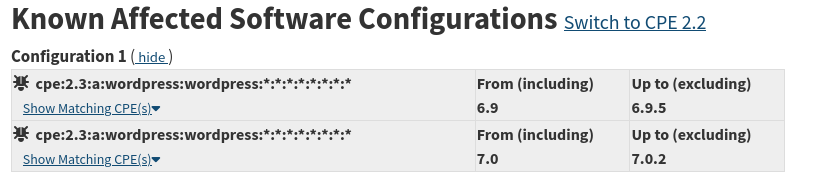

# Docs for the Rozhanitsy migrations

## Sources

This is the structure so far
|id|name|slug|url|injest_base_url|
|-|-|-|-|-|
|0|Open Source Vulnerabilities|osv|https://osv.dev|https://osv-vulnerabilities.storage.googleapis.com/|
|1|National Vulnerability Database|nvd|https://nvd.nist.gov|https://services.nvd.nist.gov/rest/json/cves/2.0|

## Ingest records

Holds logs and raw data from an ingest. I opted for storing the whole payload because now there is no need to refetch if I decide to add something to the API later on.

## Vulnerabilities

Processed unified table

## Affected versions

Version ranges tied to a vulnerability, in case of multiple version ranges. Also handles telling the API if the version is including or excluding.

